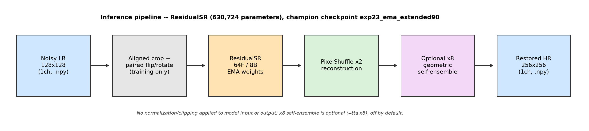
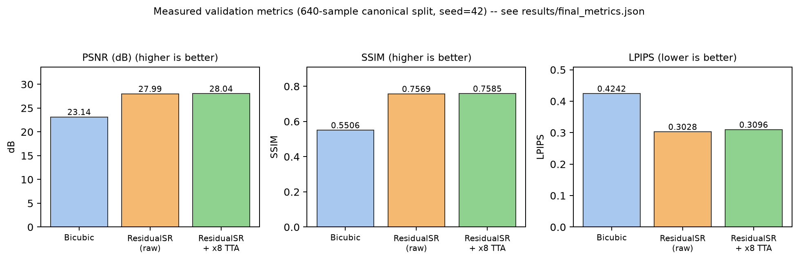

# Idea Submission Content — KLA / i4C Hackathon

**Problem Statement**: AI-Based Restoration of Degraded Images

This file contains exact, ready-to-paste content for Slides 1–9 of the
official Hackathon Idea Submission Template (`TeamName_KLA_PS01.pptx`). No
official `.pptx` template file, and no draft `.pptx` built from it, is
tracked in this repository (both the local draft-generation script and any
`.pptx` it produces are intentionally excluded from Git — see
`.gitignore`). This Markdown file is therefore the primary, tracked
deliverable for the idea-submission content.

Every number below is measured and reproducible from this repository (see
`results/final_metrics.json`, `results/final_benchmark.json`,
`EXPERIMENT_LOG.md`). Anything not implemented or not yet measured is
explicitly labeled as such — nothing here is presented as a proven result
unless it was actually run and scored.

---

## Slide 1 — Team Details

- **Team name**: `[Superconductor Semistars]`
- **Members / roles**:
`[Rohan Muthu (23BCE2243) — Data Processing & Degradation Analysis]`
`[Uday Pisharody (23BCE2165) — Model Development, Training & System Integration]`
`[Farwah Shajahan (23BEC0452) — Model Evaluation, Optimization & Experimentation]`
- **College name**: `[Vellore Institute of Technology (VIT), Vellore]`
- **Contact details** (email/phone): `[udaypisharody@gmail.com / +91 96067 60360]`

---

## Slide 2 — Problem Statement Addressed

**AI-Based Restoration of Degraded Images**

Semiconductor manufacturing pipelines depend on high-fidelity imagery at
every inspection and metrology step. Acquisition constraints — sensor noise,
short exposure/high-throughput scanning, and physical resolution limits —
routinely degrade the images that downstream systems rely on:

- **Defect inspection**: noise and low resolution can mask genuine defects
  or, conversely, produce false positives from noise artifacts mistaken for
  defects.
- **Metrology**: sub-pixel accuracy in critical-dimension measurement
  degrades directly with image noise and effective resolution.
- **Low-quality acquisition**: faster/cheaper acquisition modes trade image
  quality for throughput; software restoration can partially recover that
  quality without new hardware.
- **Structural recovery for automated inspection**: automated (non-human)
  inspection pipelines need consistent, high-fidelity input — restoring
  degraded images before they reach an automated classifier/detector can
  improve the reliability of that downstream stage.

This submission restores paired noisy low-resolution (~128x128) grayscale
images to clean 2x-resolution (~256x256) images, addressing the noise +
super-resolution component of this problem directly on the provided
paired dataset. **No claim is made here about deployment inside a specific
KLA inspection tool or about defect-detection accuracy improvements** —
those would require inspection-pipeline-level evaluation this repository
does not perform; the claims above are limited to why image restoration is
a relevant capability for this domain.

---

## Slide 3 — Idea Description

**Approach**: a single lightweight residual CNN (`ResidualSRNet`,
630,724 parameters), trained end-to-end on paired (NoisyLR, GT) supervision
with a pixel-fidelity loss (L1), to jointly denoise and 2x super-resolve in
one forward pass.

**Why a lightweight residual CNN, not a larger network**: this was tested
empirically, not assumed. An EDSR-lite (1.37M params, 2.2x larger), a
NAFNet-SR-style gated architecture (432K params), and a SwinIR-lite
windowed-attention transformer (348K params) were all trained under matched
conditions and **all underperformed the smaller ResidualSR baseline** (by
-0.15 dB, -0.49 dB, and -0.27 dB PSNR respectively — see
`EXPERIMENT_LOG.md` Experiments 9/12/13). For this dataset size (3,200 paired
images) and degradation profile, additional capacity did not translate into
accuracy; a small residual network with global skip connections and
`PixelShuffle` upsampling was sufficient and is cheap to train/run.

**How paired supervision is used**: every training step crops a spatially
aligned (LR, GT) pair at a fixed 2x coordinate relationship, applies
identical flip/rotation augmentation to both, and optimizes L1 pixel loss
between the model's 2x output and GT. Validation always uses full,
uncropped images so validation PSNR/SSIM stay directly comparable to the
classical bicubic baseline.

**How the combined degradation problem is handled**: this repository does
**not** implement a dedicated speckle-removal module, a separate denoising
stage, or a hand-designed noise model inside the network. Degradation is
handled **jointly**, implicitly, by the single paired-reconstruction model —
the network learns to invert whatever combination of noise and downsampling
produced NoisyLR from GT, purely from paired examples. This is a deliberate
simplicity choice, empirically justified by measurement (see below), not an
omission.

**How the three required degradation modes are addressed**, concretely, by
this one model:

- **Speckle / signal-dependent noise**: not modeled with a fixed
  multiplicative formula — instead learned end-to-end from paired
  noisy/clean training examples, so the network adapts to the actual
  measured signal-dependence (see the forensics below) rather than an
  assumed noise law.
- **Gaussian / additive noise**: suppressed by the same residual CNN through
  the identical paired-reconstruction (L1) objective — there is no separate
  Gaussian-specific denoising stage; the single trunk learns whatever
  additive component is present as part of the same inversion.
- **2x super-resolution**: the trunk's reconstructed features are passed
  through `PixelShuffle(2)`, producing the `256x256` restored HR image from
  the `128x128` LR input in one learned upsampling step.

**What the degradation actually looks like (measured, not assumed)** — a
dedicated forensics pass (`analyze_degradation.py`, 3,200 pairs; full report
in `results/degradation_analysis/degradation_report.md`) found:

- The clean-to-noisy corruption is dominated by **strongly signal-dependent
  noise** (residual std grows from 0.012 in dark regions to 0.163 in bright
  regions — a 13.6x spread, fit at R²=0.9995 to a quadratic
  variance-vs-intensity model). This is much closer to sensor-noise/speckle
  behavior (multiplicative, intensity-dependent) than to flat,
  intensity-independent Gaussian noise.
  the fitted quadratic model achieves R²=0.9995 against the measured
  per-bin variance.
- **No usable blur** (best-fit pre-downsampling Gaussian blur improved MSE
  by only 0.33%) and **no fixed sensor pattern** (dataset-averaged residual
  map is indistinguishable from pure-noise averaging, ratio 1.01) — so the
  degradation is well-modeled as bicubic downsampling plus signal-dependent
  noise, not blur-then-downsample or a repeatable per-pixel offset.
- Noise is **spatially near-white** (max autocorrelation 0.05 at any tested
  offset), consistent with per-pixel sensor noise rather than a spatially
  structured corruption.

This measurement directly informed later experiments (see Slide 5) —
notably a still-untested, high-confidence idea (variance-weighted loss)
derived exactly from this signal-dependence finding.

---

## Slide 4 — Proposed Solution

- **Architecture**: `ResidualSRNet` — `Conv3x3(1->64) -> 8x ResidualBlock
  (Conv3x3->ReLU->Conv3x3 + identity skip) -> Conv3x3 -> global skip ->
  Conv3x3(64->4) -> PixelShuffle(2)`. 630,724 trainable parameters.
- **Training pipeline**: Adam optimizer, initial LR `1e-4`,
  `ReduceLROnPlateau` (factor 0.5, patience 3, monitoring validation PSNR),
  batch size 16, L1 pixel loss, seed 42, 90 epochs (in staged continuations —
  see `EXPERIMENT_LOG.md` Experiments 6/15/16/19-23).
- **Preprocessing**: raw `float32` values used unchanged — no
  normalization, no clipping, no resizing outside the model's own learned
  2x upsampling. GT/LR spatial alignment is exact (`src/transforms.py`).
- **Augmentation**: spatially aligned random 96x96 LR / 192x192 GT crop per
  training step, plus independent horizontal/vertical flips (p=0.5 each)
  and a uniformly chosen 0/90/180/270-degree rotation, applied identically
  to LR and GT so alignment is never broken.
- **EMA**: an exponential moving average of model weights (decay 0.999) is
  maintained throughout training and used for both validation-time model
  selection and the final submitted weights — measurably better than the
  raw (non-EMA) weights at the same epoch (see Slide 5).
- **Loss**: plain L1 (mean absolute error) between prediction and GT.
  Alternatives (MSE, Charbonnier, L1+SSIM, mixed L1/MSE) were tried and
  **did not beat L1** — see Slide 5 and `EXPERIMENT_LOG.md`.
- **Validation**: always full, uncropped 128x128->256x256 images, no
  augmentation — kept directly comparable to the classical bicubic
  reference throughout every experiment in this project.
- **Upsampling**: `PixelShuffle(2)` — a single learned 2x upsampling
  operation, not iterative/multi-stage.
- **Optional x8 self-ensemble (TTA)**: at inference only, `--tta x8`
  averages predictions over all 8 combinations of flip/90-degree-rotation.
  Measured effect: +0.046 dB PSNR at ~3.2x the inference cost (see Slide 7)
  — available, off by default (see Slide 6/7 for the tradeoff and why
  `none` is the submission default).

---

## Slide 5 — Innovation & Uniqueness

**Implemented AND evaluated (proven, measured results — see
`EXPERIMENT_LOG.md` for every number):**

- Empirical, quantitative degradation forensics on the full 3,200-pair
  dataset (not assumed/eyeballed) — identified the corruption as
  signal-dependent, blur-free, pattern-free noise, and directly motivated
  later experiments.
- Lightweight ResidualSR deliberately chosen over larger architectures
  (EDSR-lite, NAFNet-SR, SwinIR-lite) after measuring all three underperform
  it — capacity was tested, not assumed to help.
- EMA weight averaging — measured improvement over successive epoch
  extensions (e.g. 27.7656 dB non-EMA at epoch 70 vs. 27.9893 dB with EMA
  continued to epoch 90).
- Geometric x8 self-ensemble (TTA) — measured +0.046 dB PSNR / +0.0016 SSIM,
  with a measured latency cost (3.23x) and a measured LPIPS regression
  reported honestly (Slide 6) rather than omitted.
- Reproducible ablation framework — 30 recorded experiments in
  `EXPERIMENT_LOG.md`, each with exact commands, parameter counts, and
  measured results, including honest negative results (Charbonnier loss,
  MSE loss, L1+SSIM loss, synthetic noise augmentation, cosine LR schedule,
  bicubic-residual learning, and two rejected model ensembles all measured
  and **rejected** because they did not beat the champion).
- Larger training crop (96x96 vs. the original 64x64) and longer training —
  each independently measured to improve PSNR before being adopted.

**Implemented but NOT YET benchmarked (real code, real tests, zero training
runs — do not read these as proven improvements):**

- **Variance-weighted L1 loss** (`--loss weighted_l1`) — reweights pixel
  loss by the inverse of the measured signal-dependent noise variance from
  the degradation forensics above. This is the forensics report's own
  *highest-ranked* recommendation and has never been trained.
- **Hard-patch / informative-patch sampling** (`--hard-patch-sampling`) —
  biases training crops toward high-gradient regions.
- **Denoising stem** (`--denoise-stem`) — an optional small pre-trunk
  gated-convolution denoising stage, motivated by the same signal-dependent
  noise finding.
- **Lightweight Residual Dense Block variant** (`--rdb-block`) — an
  RDN-inspired dense-connectivity block, actually *smaller* than the
  baseline (374,596 vs. 630,724 params) at matched depth.
- **Noise-conditioned ResidualSR** (`--noise-conditioning`, Experiment 25) —
  feeds the model an explicit per-pixel noise-level estimate as a second
  input channel; implementation/tests complete, no training run started.
- **Channel attention and multi-scale receptive-field blocks** — implemented
  and unit-tested; a real training run exists on disk but is invalid
  (stopped at 10 of 90 planned epochs, wrong crop size) and is explicitly
  **not** treated as a result — see `EXPERIMENT_LOG.md`'s Experiment 26
  caveats.
- **N-checkpoint prediction averaging / automated alpha-search ensembling**
  tooling (`evaluate_ensemble.py --checkpoints ... --alpha-search`) — built
  and tested; only smoke-tested on a 32-image subset so far, not a
  validated full-scale result.

---

## Slide 6 — Results

| | PSNR (dB, higher better) | SSIM (higher better) | LPIPS (lower better) |
| --- | ---: | ---: | ---: |
| Bicubic (classical baseline) | 23.1413 | 0.550604 | 0.4242 |
| ResidualSR (raw, no TTA) | 27.9893 | 0.756916 | 0.3028 |
| ResidualSR + x8 TTA | **28.0355** | **0.758519** | 0.3096 |

Measured on the canonical 640-image validation split (seed 42,
`val_fraction=0.2`), identical split for every row. Improvement over
bicubic: **+4.8480 dB** PSNR (raw) / **+4.8942 dB** (x8). Note LPIPS is
reported honestly even though x8 TTA is very slightly *worse* on it
(0.3028 -> 0.3096) despite improving PSNR/SSIM — a genuine, measured
tradeoff, not cherry-picked.

**Visual comparison** (Noisy LR | Bicubic | Restored | Ground Truth), 5
representative validation samples selected deterministically (evenly spaced
indices `[0, 128, 256, 384, 511]` through the fixed canonical validation
order — not hand-picked for best appearance):

`submission/assets/results/sample_000001.png`
`submission/assets/results/sample_000621.png`
`submission/assets/results/sample_001328.png`
`submission/assets/results/sample_001975.png`
`submission/assets/results/sample_002597.png`

---

## Slide 7 — Technology & Feasibility

| | |
| --- | --- |
| Language / framework | Python 3.12.10, PyTorch 2.7.1 |
| Core libraries | NumPy, scikit-image (PSNR/SSIM), LPIPS 0.1.4 (perceptual metric) |
| Training GPU | **NVIDIA GeForce RTX 4060 Laptop GPU** (~8 GB VRAM) — laptop, not desktop |
| CUDA | 12.8 (`torch==2.7.1+cu128`); code has no GPU-model-specific logic — `torch.device("cuda" if torch.cuda.is_available() else "cpu")` throughout, verified to run on CPU as a fallback |
| Model parameters | 630,724 |
| Packaged inference weights | `weights/residualsr_final_ema.pt`, **2.42 MiB** |
| Full training checkpoint (not submitted) | ~9.68 MiB (includes optimizer/EMA/scheduler state) |
| Per-epoch training time (measured, same architecture/crop) | ~25–27 s/epoch (Experiment 6, RTX 4060 Laptop) — the submitted champion trained 90 such epochs across staged continuations (Experiments 6/15/16/19–23); no single unbroken wall-clock total was recorded for the full 90-epoch run |
| **Inference latency, `--tta none`** (measured, `benchmark_inference.py`) | **15.57 ms/image mean**, 64.24 img/s throughput |
| **Inference latency, `--tta x8`** (measured) | **50.22 ms/image mean** (3.23x slower), 19.91 img/s throughput |
| Peak CUDA activation memory | 21.3 MiB (`none`) / 23.3 MiB (`x8`) — single-image forward-pass activation memory only, not total process VRAM footprint |

**All latency/memory numbers above were measured locally on the RTX 4060
Laptop GPU** (`results/final_benchmark.json`). KLA's own benchmarking will
run on an H100; this repository makes no H100-specific assumptions (no
hard-coded GPU index, no laptop-only thermal APIs in the inference path, no
Windows-only paths, portable `pathlib` throughout) so `benchmark_inference.py`
can be re-run there directly for H100-specific numbers — those numbers are
not predicted or claimed here.

---

## Slide 8 — GitHub & Video Link

- **GitHub repository**: https://github.com/udaypisharody05/kla-image-restoration
- **Video URL**: Not provided (optional per the template).

---

## Slide 9 — References

- Lim, B. et al. (2017). *Enhanced Deep Residual Networks for Single Image
  Super-Resolution (EDSR)*. CVPRW. — architecture baseline tried
  (Experiment 9, EDSR-lite) and the origin of the geometric 8-way
  self-ensemble technique used here (`--tta x8`).
- Hu, J., Shen, L., & Sun, G. (2018). *Squeeze-and-Excitation Networks*.
  CVPR. — the channel-attention mechanism implemented in
  `src/models/attention.py::ChannelAttention` (squeeze -> reduce -> ReLU ->
  expand -> sigmoid gate) follows this formulation.
- Zhang, Y. et al. (2018). *Residual Dense Network for Image
  Super-Resolution (RDN)*. CVPR. — inspiration for the optional lightweight
  Residual Dense Block variant (`--rdb-block`, not yet benchmarked).
- Zhang, Y. et al. (2018). *Image Super-Resolution Using Very Deep
  Residual Channel Attention Networks (RCAN)*. ECCV. — SR-specific context
  for applying channel attention inside a residual SR trunk.
- Chen, L. et al. (2022). *Simple Baselines for Image Restoration
  (NAFNet)*. ECCV. — architecture baseline tried (Experiment 12,
  NAFNet-SR) and the "simple gate" mechanism the optional denoising stem's
  `SimpleGateBlock` is derived from.
- Liang, J. et al. (2021). *SwinIR: Image Restoration Using Swin
  Transformer*. ICCVW. — architecture baseline tried (Experiment 13,
  SwinIR-lite).
- Polyak, B. T., & Juditsky, A. B. (1992). *Acceleration of Stochastic
  Approximation by Averaging*. SIAM J. Control Optim. — the weight-averaging
  principle behind this project's EMA training.
- Zhang, R. et al. (2018). *The Unreasonable Effectiveness of Deep Features
  as a Perceptual Metric (LPIPS)*. CVPR. — the perceptual metric used for
  the LPIPS numbers reported here (`lpips` package, AlexNet backbone).
- Dataset/problem statement: KLA / i4C Hackathon, *AI-Based Restoration of
  Degraded Images* (paired grayscale `.npy` NoisyLR/GT dataset, 3,200
  training pairs, 400 test images).
